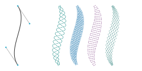

# `stitch_generator`

`stitch_generator` is a python package that generates stitch patterns for machine embroidery. It
provides stitch effects that can be applied to simple base shapes to create complex stitch patterns
like motif stitches or satin stitches. `stitch_generator` calculates the coordinates of the
stitches. For writing them to machine embroidery files, it uses
[pyembroidery](https://github.com/EmbroidePy/pyembroidery).

`stitch_generator` includes parametric designs that can be exported to various embroidery file
formats using a simple command line interface. These designs have parameters that influence the
resulting machine embroidery files. A typical example is the embroidery file format or the stitch
length. These parameters can be set via command line. See
[exporting designs](doc/exporting_designs.md)

## Stitch Effects
The image below shows some examples of stitch effects. On the left is the base shape, a cubic bezier
curve. On the right are stitch effects which have been applied to the base shape.

