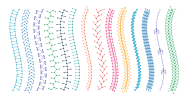
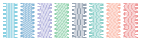

# Stitch Generator

Stitch Generator creates stitch patterns for machine embroidery. It converts basic shapes like
lines, Bézier curves or circles to decorative stitch patterns like satin stitches or motif stitches.

## Stitch Effects

Stitch Effects use a Path as input and return an array of stitch coordinates as output.


On the left is an example of a path that consists of a cubic Bézier curve with a constant width.
On the right there are examples of stitch effects applied to the path. The dots represent the
coordinates of the stitches.

See [List of Stitch Effects](doc/list_of_stitch_effects.md) for an overview over the available
stitch effects.

## Decorative Stitches

Stitch Generator provides some pre-defined stitch effects called decorative stitches. These are
mostly created with the stitch effects motif_chain or motif_to_points and a fixed motif.



The decorative stitches demonstrate how to use stitch effects and can be copied and adapted in order
to create own stitch effects.

See [List of Decorative Stitches](doc/list_of_decorative_stitches.md) for an overview over the
available decorative stitches.

## Stitch Patterns
Stitch Generator provides multiple sampling functions that can be used to create stitch patterns.

In this example sampling functions are used in combination with a meander stitch effect:



See [Sampling Functions](doc/sampling_functions.md) for an overview over the available sampling
functions.

# Usage
## Creating Paths
A Path consist of:
- a center line that defines the shape
- a direction that defines in which direction the left and right boundary of the path go
- a width that defines the distance between the left and right boundary of the path
- a stroke alignment that defines how the left and right boundary are aligned relative to the center
  line

``` python
from stitch_generator.framework.path import Path
from stitch_generator.functions.functions_1d import constant
from stitch_generator.functions.functions_2d import constant_direction
from stitch_generator.shapes.line import line

path = Path(shape=line((0, 0), (100, 0)),
            direction=constant_direction(0, -1),
            width=constant(10),
            stroke_alignment=constant(0.5))
```

See [Paths](doc/paths.md) for more details about Paths.

## Using Stitch Effects

See [List of Stitch Effects](doc/list_of_stitch_effects.md) for documentation of the stitch effects
and their parameters.

Example for creating a satin stitch effect with a regular spacing of 1 mm between the zig-zag lines:

``` python
from stitch_generator.stitch_effects.satin import satin
from stitch_generator.functions.connect_functions import simple_connect
from stitch_generator.sampling.sample_by_length import regular

stitch_effect = satin(sampling_function=regular(1), connect_function=simple_connect)
```

A Stitch Effect is a function that expects a Path as parameter and returns stitch coordinates.
To apply the stitch effect, call it with a path as parameter:

``` python
stitches = stitch_effect(path)
```

`stitches` is a two-dimensional numpy ndarray. Dimension 0 is the number of stitches. Dimension 1
contains the x and y coordinate of each stitch:
```
>>> stitches
array([[  1.,   5.],
       [  2.,  -5.],
       [  3.,   5.],
       ...,
       [ 98.,  -5.],
       [ 99.,   5.],
       [100.,  -5.]])
```
