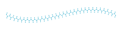
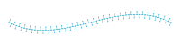
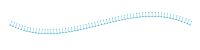
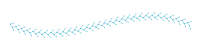

# List of Decorative Stitches

| Name                                            | Example                                                                                                               |
|:------------------------------------------------|:----------------------------------------------------------------------------------------------------------------------|
| [Alternating Triangles](#alternating-triangles) |                                                          |
| [Arrow Chain](#arrow-chain)                     |                                                                    |
| [Chevron Stitch](#chevron-stitch)               |                                                                 |
| [Cretan Stitch](#cretan-stitch)                 |  <br/>  |
| [E-Stitch](#e-stitch)                           |  <br/>            |
| [Feather Stitch](#feather-stitch)               |                                                                 |
| [Overlock Stitch](#overlock-stitch)             |                                                                |
| [Rhomb Motif Stitch](#rhomb-motif-stitch)       |                                                             |
| [Stem Stitch](#stem-stitch)                     |  <br/>      |
| [Three Arrows](#three-arrows)                   |                                                                   |
| [X-Motif Stitch](#x-motif-stitch)               |                                                                 |

## Alternating Triangles

Example:

```python
from stitch_generator.collection.stitch_effects.decorative_stitches import alternating_triangles

effect = alternating_triangles(spacing=3, line_length=4, width=5, repetitions=3)
stitches = effect(path)
```


## Arrow Chain

Example:

```python
from stitch_generator.collection.stitch_effects.decorative_stitches import arrow_chain

effect = arrow_chain(arrow_width=5, arrow_length=2, arrow_spacing=3)
stitches = effect(path)
```


## Chevron Stitch

Example:

```python
from stitch_generator.collection.stitch_effects.decorative_stitches import chevron_stitch

effect = chevron_stitch(spacing=6, line_length=3, width=5, repetitions=5)
stitches = effect(path)
```


## Cretan Stitch

Example:

```python
from stitch_generator.collection.stitch_effects.decorative_stitches import cretan_stitch

effect = cretan_stitch(spacing=6, stitch_width=0.1, stitch_length=3, repetitions=4, zigzag_width=2)
stitches = effect(path)
```



Example:

```python
from stitch_generator.collection.stitch_effects.decorative_stitches import cretan_stitch

effect = cretan_stitch(spacing=6, stitch_width=0.1, stitch_length=3.5, repetitions=4)
stitches = effect(path)
```



## E-Stitch

Example:

```python
from stitch_generator.collection.stitch_effects.decorative_stitches import e_stitch

effect = e_stitch(spacing=3, line_length=4, stitch_length=10, angle=0)
stitches = effect(path)
```



Example:

```python
from stitch_generator.collection.stitch_effects.decorative_stitches import e_stitch

effect = e_stitch(spacing=3, line_length=4, stitch_length=10, angle=45)
stitches = effect(path)
```


## Feather Stitch

Example:

```python
from stitch_generator.collection.stitch_effects.decorative_stitches import feather_stitch

effect = feather_stitch(spacing=3, stitch_width=0, stitch_length=3.5, repetitions=2)
stitches = effect(path)
```



## Overlock Stitch

Example:

```python
from stitch_generator.collection.stitch_effects.decorative_stitches import overlock_stitch

effect = overlock_stitch(length=3, width=5)
stitches = effect(path)
```


## Rhomb Motif Stitch

Example:

```python
from stitch_generator.collection.stitch_effects.decorative_stitches import rhomb_motif_stitch

effect = rhomb_motif_stitch(spacing=3, width=6, length=5)
stitches = effect(path)
```


## Stem Stitch

Example:

```python
from stitch_generator.collection.stitch_effects.decorative_stitches import stem_stitch

effect = stem_stitch(spacing=3, stitch_width=0.6, stitch_length=5, repetitions=5, angle=25)
stitches = effect(path)
```


Example:

```python
from stitch_generator.collection.stitch_effects.decorative_stitches import stem_stitch

effect = stem_stitch(spacing=3, stitch_width=5, stitch_length=4, repetitions=5, angle=0)
stitches = effect(path)
```


## Three Arrows

Example:

```python
from stitch_generator.collection.stitch_effects.decorative_stitches import three_arrows

effect = three_arrows(arrow_spacing=2, group_spacing=20, start_end_spacing=10, stitch_length=3)
stitches = effect(path)
```


## X Motif Stitch

Example:

```python
from stitch_generator.collection.stitch_effects.decorative_stitches import x_motif_stitch

effect = x_motif_stitch(spacing=3, width=6, length=5)
stitches = effect(path)
```


