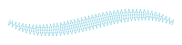

# Contour
A running stitch line along the left and right boundary of the Path, closed at both ends.

Example:
```python
    from stitch_generator.stitch_effects.path_effects.contour import contour

    effect = contour(stitch_length=3)    
    stitches = effect(path)
```


# Lattice
A continuous line going back and forth between the left and right boundary of the Path. Creates
a grid-like pattern.

Example:
```python
    from stitch_generator.collection.functions.functions_1d import linear_0_1
    from stitch_generator.stitch_effects.path_effects.lattice import lattice

    effect = lattice(strands=7, pattern_f=linear_0_1, pattern_length=20) 
    stitches = effect(path)
```


Example:
```python
    from stitch_generator.functions.functions_1d import square
    from stitch_generator.stitch_effects.path_effects.lattice import lattice

    effect = lattice(strands=3, pattern_f=square, pattern_length=30)
    stitches = effect(path)
```


# Meander
A line that meanders back and forth between the left and right boundary of the Path.

Example:
```python
    from stitch_generator.sampling.sample_by_length import regular
    from stitch_generator.stitch_effects.path_effects.meander import meander

    effect = meander(spacing_function=regular(3), line_sampling_function=regular(3))
    stitches = effect(path)
```


Example:
```python
    from stitch_generator.sampling.sample_by_length import regular
    from stitch_generator.stitch_effects.path_effects.meander import meander

    effect = meander(spacing_function=regular(2),
                     line_sampling_function=regular(3),
                     join_ends=True)
    stitches = effect(path)
```



Example:
```python
    from stitch_generator.collection.sampling.tatami_sampling import tatami_3_1
    from stitch_generator.sampling.sample_by_length import regular
    from stitch_generator.sampling.sampling_modifiers import alternate_direction, add_end, add_start
    from stitch_generator.stitch_effects.path_effects.meander import meander

    line_sampling_function = alternate_direction(
        add_start(add_end(tatami_3_1(segment_length=3))))

    effect = meander(spacing_function=regular(2),
                     line_sampling_function=line_sampling_function)
    stitches = effect(path)
```


# Satin
A zig-zag line between the left and right boundary of the path.

Also supports a variety of satin stitch patterns

The satin stitch effect does not include the underlay. To create an underlay, use the underlay
stitch effect on an underlay Path.

# Stripes
A zig-zag line along the Path. Similar to satin, but in the direction of the Path instead of
perpendicular to it

# Scribble
A zig-zag line repeating along the Path with random offsets to the side to simulate a hand-drawn
scribble line. Useful for appliqués.

# Double Satin
A zig-zag line between the left and right boundary of the Path in forward direction and an inverse
zig-zag line back from the end to the start of the Path.

Useful as part of an underlay

# Underlay
A pattern of lines to be used below satin stitches. It raises the satin stitches and gives them a
firm foundation.

To avoid that the underlay sticks out below the satin stitches, the path for the underlay should have a smaller width and be a bit shorter than the path of the Satin stitches. Use `stitch_generator.functions.get_underlay_path` to create such a Path.