# Stitch Effects

Stitch effects are functions that receive a path as parameter and return stitches. See section [Paths](paths.md) to
learn about creating paths.

stitch_generator distinguishes between path effects and shape effects:

[Path Effects](#list-of-path-effects) use the full width of the path. All stitches lie within the boundaries of the
path. [Shape Effects](#list-of-shape-effects) only use the shape (middle line) and the direction of the path. Their
stitches may not fill the area between the boundaries of the path and stitches may exceed the boundaries of the path.

## List of Path Effects

Path effects use the width and alignment of the path. Stitches lie between the boundaries of the path.

| Name                                    | Example                                                                                                                                                                                                                             |
|:----------------------------------------|:------------------------------------------------------------------------------------------------------------------------------------------------------------------------------------------------------------------------------------|
| [Contour](#contour)                     |                                                                                                                                                                                          |
| [Lattice](#lattice)                     | 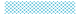 <br/>                                                                                                                           |
| [Meander](#meander)                     |  <br/>  <br/>  <br/>  |
| [Satin](#satin)                         |                                                                                                                                                                                            |
| [Scribble](#scribble)                   |  <br/>                                                                                                                                |
| [Stripes](#stripes)                     |                                                                                                                                                                                          |
| [Parallel Stripes](#parallel-stripes)   |  <br/>                                                                                                              |
| [Tile Motif](#tile-motif)               |  <br/>                                                                                                                    |
| [Variable Underlay](#variable-underlay) |                                                                                                                                                                                |
| [ZigZag](#zigzag)                       |                                                                                                                                                                                           |
| [Double ZigZag](#double-zigzag)         |                                                                                                                                                                                    |

## Contour

A running stitch line along the left and right boundary of the Path, closed at both ends.

Example:

```python
from stitch_generator.stitch_effects.path_effects.contour import contour

effect = contour(stitch_length=3)
stitches = effect(path)
```

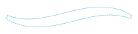

## Lattice

A continuous line going back and forth between the left and right boundary of the Path. Creates a grid-like pattern.

Example:

```python
from stitch_generator.collection.functions.functions_1d import linear_0_1
from stitch_generator.stitch_effects.path_effects.lattice import lattice

effect = lattice(strands=7, pattern_f=linear_0_1, pattern_length=20)
stitches = effect(path)
```


Example:

```python
from stitch_generator.functions.functions_1d import square
from stitch_generator.stitch_effects.path_effects.lattice import lattice

effect = lattice(strands=3, pattern_f=square, pattern_length=30)
stitches = effect(path)
```

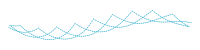

---
**NOTE**

The lattice stitch effect uses a fixed number of stitches for each line from the left to the right boundary. Therefore,
it may produce very long stitches at locations where the path is very wide. Such stitches may not be usable with an
embroidery machine. Take care to keep the paths narrow enough for the lattice stitch effect.

---

## Meander

A line that meanders back and forth between the left and right boundary of the Path.

Example:

```python
from stitch_generator.subdivision.subdivide_by_length import regular
from stitch_generator.stitch_effects.path_effects.meander import meander

effect = meander(spacing_function=regular(3), line_subdivision=regular(3))
stitches = effect(path)
```


Example:

```python
from stitch_generator.subdivision.subdivide_by_length import regular
from stitch_generator.stitch_effects.path_effects.meander import meander

effect = meander(spacing_function=regular(2),
                 line_subdivision=regular(3),
                 join_ends=True)
stitches = effect(path)
```


Example:

```python
from stitch_generator.collection.subdivision.tatami import tatami_3_1
from stitch_generator.subdivision.subdivide_by_length import regular
from stitch_generator.subdivision.subdivision_modifiers import alternate_direction, add_start, add_end
from stitch_generator.stitch_effects.path_effects.meander import meander

line_subdivision = alternate_direction(add_start(add_end(tatami_3_1(segment_length=3))))
effect = meander(spacing_function=regular(2), line_subdivision=line_subdivision)

stitches = effect(path)
```


Example:

```python
from stitch_generator.subdivision.subdivide_by_length import regular
from stitch_generator.subdivision.subdivide_by_pattern import subdivision_by_pattern
from stitch_generator.stitch_effects.path_effects.meander import meander

spacing_function = subdivision_by_pattern(pattern=(0, 0.7), pattern_length=5, alignment=0.5,
                                          offset=0)
effect = meander(spacing_function=spacing_function, line_subdivision=regular(3))
stitches = effect(path)
```

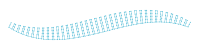

## Satin

A zigzag line between the left and right boundary of the path with intermediate stitches based on a subdivision
function.

Example:

```python
from stitch_generator.collection.subdivision.tatami import tatami
from stitch_generator.subdivision.subdivide_by_length import regular
from stitch_generator.subdivision.subdivision_modifiers import alternate_direction, add_start
from stitch_generator.stitch_effects.path_effects.satin import satin

line_subdivision = add_start(alternate_direction(
    tatami(segment_length=3, steps=5, repetitions=1, minimal_segment_size=2)))

effect = satin(spacing_function=regular(2),
               line_subdivision=line_subdivision)

stitches = effect(path)
```

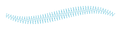

## Scribble

A zigzag line along the Path with random offsets to the side to simulate a hand-drawn scribble line.

Example:

```python
from stitch_generator.collection.subdivision.tatami import tatami_3_1
from stitch_generator.subdivision.subdivision_modifiers import alternate_direction, add_start, add_end
from stitch_generator.stitch_effects.path_effects.scribble import scribble

line_subdivision = alternate_direction(add_start(add_end(tatami_3_1(segment_length=3))))
effect = scribble(repetitions=4, line_subdivision=line_subdivision, noise_scale=0.25)
stitches = effect(path)
```


Example:

```python
from stitch_generator.collection.subdivision.tatami import tatami_3_1
from stitch_generator.subdivision.subdivision_modifiers import alternate_direction
from stitch_generator.stitch_effects.path_effects.scribble import scribble

line_subdivision = alternate_direction(tatami_3_1(segment_length=3))
effect = scribble(repetitions=10, line_subdivision=line_subdivision)
stitches = effect(path)
```


## Stripes

A zigzag line along the path with intermediate stitches based on a subdivision function.

Example:

```python
from stitch_generator.subdivision.subdivide_by_length import regular
from stitch_generator.subdivision.subdivide_by_number import subdivide_by_number
from stitch_generator.stitch_effects.path_effects.stripes import stripes

effect = stripes(steps=subdivide_by_number(6), line_subdivision=regular(3))
stitches = effect(path)
```


## Parallel Stripes

Example:

```python
from stitch_generator.subdivision.subdivide_by_length import regular
from stitch_generator.subdivision.subdivide_by_number import subdivide_by_number
from stitch_generator.stitch_effects.path_effects.stripes import parallel_stripes

effect = parallel_stripes(steps=subdivide_by_number(3), line_subdivision=regular(3))
stitches = effect(path)
```


Example:

```python
from stitch_generator.subdivision.subdivide_by_length import regular
from stitch_generator.subdivision.subdivide_by_pattern import pattern_from_spaces
from stitch_generator.stitch_effects.path_effects.stripes import parallel_stripes

steps = pattern_from_spaces((1, 2, 1, 2, 1), with_start=True, with_end=True)
effect = parallel_stripes(steps=steps, line_subdivision=regular(3))
stitches = effect(path)
```


## Tile Motif

Repeats a motif along a path and transforms it to fit into the boundaries of the path.

The stitch coordinates of the motif should be in the range [0;1]. Y-coordinate 0 is placed at the left border of the
path, Y-coordinate 1 is placed at the right border of the path. The motif is tiled in the x-direction. The parameter
motif_length and the length of the path define how often the motif is repeated along the path.

Example:

```python
from stitch_generator.collection.motifs.square_spiral import square_spiral
from stitch_generator.stitch_effects.path_effects.tile_motif import tile_motif

# create motif for tiling
spiral_level = 5
motif_scale = (1, spiral_level / (spiral_level - 1))  # make it square
motif_translation = (0.5, 0.5)  # move it into the range [0,1] in x and y direction
motif = square_spiral(level=spiral_level,
                      step_size=(1 / spiral_level)) * motif_scale + motif_translation

# create stitch effect
effect = tile_motif(motif=motif, motif_length=15)
stitches = effect(path)
```


Example:

```python
import numpy as np
from stitch_generator.collection.motifs.collection import zigzag_rectangle
from stitch_generator.subdivision.subdivide_by_number import subdivide_by_number
from stitch_generator.shapes.line import line_shape
from stitch_generator.stitch_effects.path_effects.tile_motif import tile_motif

# create motif for tiling
motif_translation = (0.5, 0.5)  # move it into the range [0,1] in x and y direction
motif = zigzag_rectangle(width=1, height=1, repetitions=8, horizontal=False) + motif_translation
motif = np.concatenate((line_shape((0, 1), (1, 0))(subdivide_by_number(4)[:-1]), motif))

# create stitch effect
effect = tile_motif(motif=motif, motif_length=5)

stitches = effect(path)
```


## Variable Underlay

A pattern of lines to be used below satin stitches. It raises the satin stitches and gives them a firm foundation.

The underlay adapts to the width of the path: Where the path is wider, there are more repetitions of the underlay. Where
the path is narrower, the underlay only has fewer repetitions.

To avoid that the underlay sticks out below the satin stitches, the path for the underlay should have a smaller width
and be a bit shorter than the path of the Satin stitches. Use `stitch_generator.framework.path.get_inset_path` to create
such a Path.

Example:

```python
from stitch_generator.framework.path import get_inset_path
from stitch_generator.subdivision.subdivide_by_length import regular
from stitch_generator.stitch_effects.path_effects.variable_underlay import variable_underlay

path = get_inset_path(path, inset=1)
effect = variable_underlay(stroke_spacing=3, line_subdivision=regular(3))

stitches = effect(path)
```


## Zigzag

A simple zigzag line between the left and right boundary of the path. In contrast to satin, it has no intermediate
stitches.

Example:

```python
from stitch_generator.subdivision.subdivide_by_length import regular
from stitch_generator.stitch_effects.path_effects.zigzag import zigzag

effect = zigzag(spacing_function=regular(3))
stitches = effect(path)
```

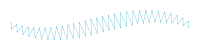

## Double Zigzag

Example:

```python
from stitch_generator.subdivision.subdivide_by_length import regular
from stitch_generator.stitch_effects.path_effects.zigzag import double_zigzag

effect = double_zigzag(spacing_function=regular(3))
stitches = effect(path)
```

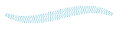

---
**NOTE**

zigzag and double_zigzag have no intermediate stitches. Therefore, they may produce very long stitches which are not
possible to use with an embroidery machine. Take care to keep the paths narrow enough for zigzag stitches.

---

## List of Shape Effects

Shape Effects ignore the width and alignment of the path. Stitches are placed based on the shape and direction of the
path.

| Name                                                | Example                                                                                                                                                                         |
|:----------------------------------------------------|:--------------------------------------------------------------------------------------------------------------------------------------------------------------------------------|
| [Motif Chain](#motif-chain)                         |  <br/> 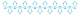 <br/>  |
| [Motif To Points](#motif-to-points)                 |                                                                                                                              |
| [Motif To Segments](#motif-to-segments)             |                                                                                                                            |
| [Running Stitch](#running-stitch)                   |                                                                                                                               |
| [Variable Running Stitch](#variable-running-stitch) | 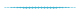                                                                                                                     |

## Motif Chain

Places a motif at positions along the path. The motif locations are defined by the motif placement function. The motifs
are connected by a simple straight line segment without intermediate stitches.

Motifs are not scaled. They should have the size which they have in the resulting stitches, i.e. motifs should not be in
the range [0;1], but rather several millimeters big. The motiv is rotated so that the positive X-axis of the motif
points into the same direction as the direction of the path at the location where the motif is placed.

Example:

```python
import numpy as np
from stitch_generator.functions.functions_1d import constant
from stitch_generator.functions.motif_generators import repeat_motif_mirrored
from stitch_generator.subdivision.subdivide_by_length import regular
from stitch_generator.stitch_effects.shape_effects.motif_chain import motif_chain

arrow = np.array(((-3, -2), (0, 0), (3, -2)))
motif_generator = repeat_motif_mirrored(arrow)
effect = motif_chain(motif_placement=regular(3), motif_generator=motif_generator,
                     motif_rotation_degrees=constant(0))

stitches = effect(path)
```

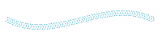

Example:

```python
import numpy as np
from stitch_generator.functions.functions_1d import constant
from stitch_generator.functions.motif_generators import repeat_motif_mirrored
from stitch_generator.subdivision.subdivide_by_length import regular
from stitch_generator.stitch_effects.shape_effects.motif_chain import motif_chain

length = 7
half_width = 2
loop = np.array(
    ((-1, 0), (length - 3, half_width), (length - 1, 0), (length - 3, -half_width), (-1, 0)))
motif_generator = repeat_motif_mirrored(loop)
effect = motif_chain(motif_placement=regular(5), motif_generator=motif_generator,
                     motif_rotation_degrees=constant(0))

stitches = effect(path)
```

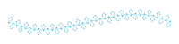

Example:

```python
import itertools
import numpy as np
from stitch_generator.functions.functions_1d import constant
from stitch_generator.subdivision.subdivide_by_pattern import pattern_from_spaces, subdivision_by_pattern
from stitch_generator.stitch_effects.shape_effects.motif_chain import motif_chain

# create line motif
motif = np.array(((0, 0), (6, 0), (0, 0)))

# create pattern for line placement
pattern = pattern_from_spaces((1, 8, 1), with_start=False, with_end=False)
motif_placement = subdivision_by_pattern(pattern=pattern, pattern_length=7, alignment=0.5, offset=0)

# create stitch effect
effect = motif_chain(motif_placement=motif_placement,
                     motif_generator=itertools.repeat(motif),
                     motif_rotation_degrees=constant(0))

stitches = effect(path)
```

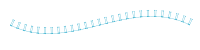

## Motif to Points

Places a motif at positions along the path. The motif locations are defined by the motif placement function. Between the
motifs, the shape of the path is subdivided with the line_subdivision function to create intermediate stitches. This
effect is similar to motif_chain, but allows bigger distances between the motifs by inserting intermediate stitches
along the path.

Motifs are not scaled. They should have the size which they have in the resulting stitch pattern.

Example:

```python
import itertools
import numpy as np
from stitch_generator.subdivision.subdivide_by_length import regular
from stitch_generator.subdivision.subdivide_by_pattern import pattern_from_spaces, subdivision_by_pattern
from stitch_generator.subdivision.subdivision_modifiers import free_start, free_end
from stitch_generator.stitch_effects.shape_effects.motif_to_points import motif_to_points

# create arrow motif
motif = np.array(((0, 0.0), (3, -3), (0, 0), (-3, -3), (0, 0)))

# create pattern for arrow placement
pattern = pattern_from_spaces((6, 1, 1, 6), with_start=False, with_end=False)
motif_placement = subdivision_by_pattern(pattern=pattern, pattern_length=30, alignment=0.5, offset=0)
motif_placement = free_start(10, free_end(10, motif_placement))

# create stitch effect
effect = motif_to_points(motif_placement=motif_placement, line_subdivision=regular(3),
                         motif_generator=itertools.repeat(motif))

stitches = effect(path)
```

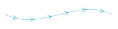

## Motif to Segments

Places a motif at positions along the path. The motif locations are defined by the motif placement function. At each
motif position, a segment of the path is cut out and replaced by the motif. The size of the cut-out segment is defined
by the parameter motif_length.

Between the motifs, the shape of the path is subdivided with the line_subdivision function to create intermediate
stitches. This effect is similar to motif_to_points, but requires a motif where start- and endpoint are different. The
motif is scaled and rotated so that the start point lies at the start of a cut-out and the end point lies at the end of
the cut-out.

Motifs are scaled to fit into the cut-outs. The original size of the motif is not relevant i.e. it can be in the
range [0;1], but does not need to be.

Example:

```python
import itertools
from stitch_generator.functions.function_modifiers import repeat
from stitch_generator.subdivision.subdivide_by_length import regular
from stitch_generator.subdivision.subdivide_by_number import subdivide_by_number
from stitch_generator.subdivision.subdivision_modifiers import free_end, free_start
from stitch_generator.shapes.circle import circle
from stitch_generator.stitch_effects.shape_effects.motif_to_segments import motif_to_segments

motif = repeat(0.5, circle(radius=7))(subdivide_by_number(8))
motif_placement = free_start(10, free_end(10, regular(25)))
effect = motif_to_segments(motif_placement=motif_placement, line_subdivision=regular(3),
                           motif_generator=itertools.repeat(motif), motif_length=14)

stitches = effect(path)
```


## Running Stitch

A running stitch along the shape of the path.

Example:

```python
from stitch_generator.stitch_effects.shape_effects.running_stitch import running_stitch

effect = running_stitch(stitch_length=3)
stitches = effect(path)
```

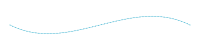

## Variable Running Stitch

A running stitch along the shape of the path that is repeated using back-and-forth movement along the path. Creates a
visually thicker line at locations with more repetitions.

The parameter width_profile defines the thickness of the running stitch line along the path. Where the width profile is
zero, the running stitch has the lowest number of repetitions, defined by the parameter min_strokes. At locations where
the width_profile is 1, the running stitch has the highest number of repetitions defined by the parameter max_strokes.

Example:

```python
from stitch_generator.functions.functions_1d import arc
from stitch_generator.stitch_effects.shape_effects.variable_running_stitch import variable_running_stitch

effect = variable_running_stitch(stitch_length=3, width_profile=arc, min_strokes=1, max_strokes=7,
                                 stroke_spacing=0.3)
stitches = effect(path)
```


