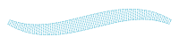
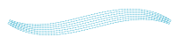
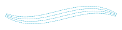

# Contour
A running stitch line along the left and right boundary of the Path, closed at both ends.

Example:

```python
from stitch_generator.stitch_effects.path_effects.contour import contour

effect = contour(stitch_length=3)    
stitches = effect(path)
```


# Lattice
A continuous line going back and forth between the left and right boundary of the Path. Creates
a grid-like pattern.

Example:

```python
from stitch_generator.collection.functions.functions_1d import linear_0_1
from stitch_generator.stitch_effects.path_effects.lattice import lattice

effect = lattice(strands=7, pattern_f=linear_0_1, pattern_length=20) 
stitches = effect(path)
```


Example:

```python
from stitch_generator.functions.functions_1d import square
from stitch_generator.stitch_effects.path_effects.lattice import lattice

effect = lattice(strands=3, pattern_f=square, pattern_length=30)
stitches = effect(path)
```


# Meander
A line that meanders back and forth between the left and right boundary of the Path.

Example:

```python
from stitch_generator.sampling.sample_by_length import regular
from stitch_generator.stitch_effects.path_effects.meander import meander

effect = meander(spacing_function=regular(3), line_sampling_function=regular(3))
stitches = effect(path)
```


Example:

```python
from stitch_generator.sampling.sample_by_length import regular
from stitch_generator.stitch_effects.path_effects.meander import meander

effect = meander(spacing_function=regular(2),
                    line_sampling_function=regular(3),
                    join_ends=True)
stitches = effect(path)
```


Example:

```python
from stitch_generator.collection.sampling.tatami_sampling import tatami_3_1
from stitch_generator.sampling.sample_by_length import regular
from stitch_generator.sampling.sampling_modifiers import alternate_direction, add_start, add_end
from stitch_generator.stitch_effects.path_effects.meander import meander

line_sampling_function = alternate_direction(
    add_start(add_end(tatami_3_1(segment_length=3))))

effect = meander(spacing_function=regular(2),
                    line_sampling_function=line_sampling_function)
stitches = effect(path)
```



Example:

```python
from stitch_generator.sampling.sample_by_length import regular
from stitch_generator.sampling.sample_by_pattern import sampling_by_pattern
from stitch_generator.stitch_effects.path_effects.meander import meander

spacing_function=sampling_by_pattern(pattern=(0, 0.7), pattern_length=5, alignment=0.5, offset=0)
effect = meander(spacing_function=spacing_function, line_sampling_function=regular(3))
stitches = effect(path)
```


# Satin
A zig-zag line between the left and right boundary of the path with intermediate stitches based on
a sampling function.

Example:

```python
from stitch_generator.collection.sampling.tatami_sampling import tatami
from stitch_generator.sampling.sample_by_length import regular
from stitch_generator.sampling.sampling_modifiers import alternate_direction, add_end, add_start
from stitch_generator.stitch_effects.path_effects.satin import satin

line_sampling_function = alternate_direction(
    add_start(add_end(tatami(segment_length=3, steps=5, repetitions=1, minimal_segment_size=2))))
effect = satin(spacing_function=regular(2),
                line_sampling_function=line_sampling_function)
stitches = effect(path)
```


# Scribble
A zig-zag line along the Path with random offsets to the side to simulate a hand-drawn scribble
line.

Example:

```python
from stitch_generator.collection.sampling.tatami_sampling import tatami_3_1
from stitch_generator.sampling.sampling_modifiers import alternate_direction, add_start, add_end
from stitch_generator.stitch_effects.path_effects.scribble import scribble

line_sampling_function = alternate_direction(add_start(add_end(tatami_3_1(segment_length=3))))
effect = scribble(repetitions=4, sampling_function=line_sampling_function, noise_scale=0.25)
stitches = effect(path)
```


Example:

```python
from stitch_generator.collection.sampling.tatami_sampling import tatami_3_1
from stitch_generator.sampling.sampling_modifiers import alternate_direction
from stitch_generator.stitch_effects.path_effects.scribble import scribble

line_sampling_function = alternate_direction(tatami_3_1(segment_length=3))
effect = scribble(repetitions=10, sampling_function=line_sampling_function)
stitches = effect(path)
```


# Stripes
A zig-zag line along the path with intermediate stitches based on a sampling function.

Example:

```python
from stitch_generator.sampling.sample_by_length import regular
from stitch_generator.sampling.sample_by_number import sample_by_number
from stitch_generator.stitch_effects.path_effects.stripes import stripes

effect = stripes(steps=sample_by_number(6), sampling_function=regular(3))
stitches = effect(path)
```



Example:

```python
from stitch_generator.sampling.sample_by_length import regular
from stitch_generator.sampling.sample_by_number import sample_by_number
from stitch_generator.stitch_effects.path_effects.stripes import parallel_stripes

effect = parallel_stripes(steps=sample_by_number(3), sampling_function=regular(3))
stitches = effect(path)
```



Example:

```python
from stitch_generator.sampling.sample_by_length import regular
from stitch_generator.sampling.sample_by_pattern import pattern_from_spaces
from stitch_generator.stitch_effects.path_effects.stripes import parallel_stripes

steps = pattern_from_spaces((1, 2, 1, 2, 1), with_start=True, with_end=True)
effect = parallel_stripes(steps=steps, sampling_function=regular(3))
stitches = effect(path)
```


# Tile Motif
A zig-zag line between the left and right boundary of the Path in forward direction and an inverse
zig-zag line back from the end to the start of the Path.

Useful as part of an underlay

# Variable Underlay
A pattern of lines to be used below satin stitches. It raises the satin stitches and gives them a
firm foundation.

To avoid that the underlay sticks out below the satin stitches, the path for the underlay should have a smaller width and be a bit shorter than the path of the Satin stitches. Use `stitch_generator.functions.get_underlay_path` to create such a Path.