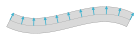
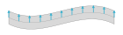
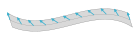
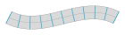
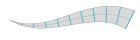
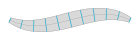

# Paths

In Stitch Generator, a path is an object on which stitch effects can be applied.

A path consist of:

- A shape, which is the center line of the path. This can be any shape like e.g. a line, Bézier curve, circle or a
  sequence of multiple connected shapes.
- A direction that defines in which direction the left and right boundary of the path go
- A width that defines the distance between the left and right boundary of the path
- A stroke alignment that defines how the left and right boundary are aligned relative to the center line

All four components of the path are functions defined in the range [0, 1], where 0 is the start of the path and 1 is the
end of the path. For example, `path.shape(0)` returns the start point of the path, `path.shape(1)` returns the end point
of the path. The functions can also be called with an array of parameters: `path.shape([0, 0.25, 0.5, 0.75, 1])` returns
five points along the path at the given offsets.

## Shape

The shape of a path is a Function2D. It returns a position along the center line of the path.

Example: Positions along a Bézier curve


## Direction

The direction of a path is a Function2D. It returns the direction vector to the left side of the path. The direction
function should return normalized vectors. Longer or shorter direction vectors lead to a wider or narrower path.

Example: Direction vectors which are perpendicular to the tangent of the curve



Example: Direction vectors pointing in the direction of the negative y-axis, independent of the curve shape



Example: Direction vectors turned by -45 degrees relative to the perpendicular of the curve



## Width

The width of a path is a Function1D. It returns the distance between the left and right border of the path.

Example: Constant width of 15 along the path



Example: Width interpolated between 0 at the start of the path and 20 at the end of the path



Example: Width of 5 at the start, 15 in the middle, and 5 at the end of the path



## Stroke Alignment

The stroke alignment of a path is a Function1D. It returns the aspect ratio of the part left of the center line relative
to the whole width of the path. The stroke alignment should be a value between 0 and 1.

- 0 means that the aspect ratio of the left part to the total width is 0, i.e. the whole width of the path is right of
  the center line.
- 0.5 means that the aspect ratio of the left part to the total width is 0.5, i.e. half of the width of the path is left
  of the center line, the other half is right.
- 1 means that the aspect ratio of the left part to the total width is 1, i.e. the whole width of the path is left of
  the center line.

Example: Constant stroke alignment of 0.75. 0.75 of the width is left of the center line.


Example: Constant stroke alignment of 0.25. 0.25 of the width is left of the center line.


Example: Stroke alignment interpolated between 0 at the start and 1 at the end. Path shifts from right to left of the
center line along the length of the path


Example: Varying stroke alignment along the path. Path shifts to the left and right in a sinus wave between stroke
alignments 0.2 and 0.8


# Creating a path

To create a path, at least the shape and direction are needed. If the parameter width is skipped, a constant width of 1
is used for the path. If the parameter stroke_alignment is skipped, a constant stroke alignment of 0.5 is used for the
path.

## Create  straight line

This creates a path from (-50, 0) to (50, 0) with a width of 10:

```python
from stitch_generator.shapes.line import line
from stitch_generator.framework.path import Path
from stitch_generator.functions.functions_1d import constant

shape, direction = line(origin=(-50, 0), to=(50, 0))
path = Path(shape=shape, direction=direction, width=constant(10), stroke_alignment=constant(0.5))
```

Note: If the width and stroke alignment are not needed, it is also possible to construct a path directly with the output
of the line function:

```python
from stitch_generator.shapes.line import line
from stitch_generator.framework.path import Path

path = Path(*line(origin=(-50, 0), to=(50, 0)))
```

## Create a path from a Bézier curve

A path can be created from a Bézier curve. The Bézier curve can have three control points for a quadratic curve, four
control points for a cubic curve or more points.

```python
from stitch_generator.shapes.bezier import bezier
from stitch_generator.framework.path import Path
from stitch_generator.functions.functions_1d import constant

control_points = [(-50, 0), (-20, 20), (20, -20), (50, 0)]
shape, direction = bezier(control_points)
path = Path(shape=shape, direction=direction, width=constant(10), stroke_alignment=constant(0.5))
```

Or without width and stroke alignment:

```python
from stitch_generator.shapes.bezier import bezier
from stitch_generator.framework.path import Path

control_points = [(-50, 0), (-20, 20), (20, -20), (50, 0)]
path = Path(*bezier(control_points))
```
