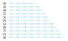
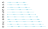
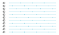
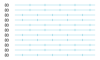
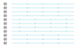
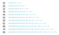

# Sampling Functions

Sampling functions are functions which take a float value 'total_length' as parameter and return an
array of float values between 0 and 1. They are used to subdivide the range [0, 1] into segments,
based on the parameters of the sampling function.

For example, the regular sampling for example distributes the samples evenly over the full range:

```python
from stitch_generator.sampling.sample_by_length import regular

regular_sampling = regular(segment_length=2)
samples = regular_sampling(total_length=10)
print(samples)
```

Output:

    array([0. , 0.2, 0.4, 0.6, 0.8, 1. ])

## Sampling by length
The `sampling_by_length` or `regular` sampling ensures that a sample is at the start (value 0) and
a sample is at the end (value 1) and that the segments between them have equal lengths.

Example:

    sampling_by_length(segment_length=20)

This sampling will divide a total length of 60 in three equal segments of length 20. Lengths above
60 have an increased segment size. At length 70 the number of segments is increased to 4 and the
segments are smaller than 20. With increasing total length the segment length is increased to 20
again:


Sampling by length does not guarantee the exact segment lengt,h but it guarantees that all samples
are equally spaced.

## Sampling by fixed length
The `sampling_by_fixed_length` keeps the segment length fixed and fits as many segments as possible
into the total length.

Example: 

    sampling_by_fixed_length(segment_length=20)


### Alignment
The `sampling_by_fixed_length` has a parameter `alignment` that defines how the segments are aligned
in the total length. The alignment refers to the total length of the sampling, i.e. an alignment of
0 ensures that samples are aligned to the start of the total length. An alignment of 1 ensures that
samples are aligned to the end of the total length and an alignment of 0.5 ensures that samples are aligned to the middle of the total length.

Example `alignment=0`:

    sampling_by_fixed_length(segment_length=20, alignment=0)


Example `alignment=0.5`:

    sampling_by_fixed_length(segment_length=20, alignment=0.5)


Example `alignment=1`:

    sampling_by_fixed_length(segment_length=20, alignment=1)


### Offset
The `sampling_by_fixed_length` has a parameter `offset` that defines how the samples are aligned
in the segment. The offset refers to the total length of the segment, i.e. an alignment of 0 ensures that samples are aligned to the start of the segment. An alignment of 1 ensures that samples are
aligned to the end of the segment and an alignment of 0.5 ensures that samples are aligned to the
middle of the segment.

Example `offset=0.5`:

    sampling_by_fixed_length(segment_length=20, offset=0.5)


## Sampling by Number
The `sampling_by_number` always returns the same number of segments, independend of the total
length.

Example: 

    sampling_by_number(number_of_segments=4)


## Sampling by pattern

The `sampling_by_pattern` creates samples with a repeating pattern. The pattern is an array of values
between in the range from 0 to 1. The pattern_length defines how long one repetition of the pattern
is.

The parameters alignment and offset are defined the same way as in `sampling_by_fixed_length`.

Example:
    
    sampling_by_pattern(pattern=[0, 0.25], pattern_length=10, alignment=0, offset=0)



Example:
    
    sampling_by_pattern(pattern=[0.4, 0.5, 0.6], pattern_length=15, alignment=0.5, offset=0.5)



## Sampling by number
The `sampling_by_number` always returns the same number of segments, independend of the total
length.


Example: 

    sampling_by_number(number_of_segments=4)


## Tatami sampling

tatami is a sampling by fixed length with a sampling modifier, that loops through different offset
values each time the sampling fucntion is called. This means, that the sampling function returns
samples which are shifted with an offset in each subsequent call.

Example: A tatami sampling where the segments are shifted by 1/3 in each call:
    
    tatami_3_1(segment_length=20)
    


Example:
    
    tatami(segment_length=15, steps=2, repetitions=2, alignment=0, minimal_segment_size=1)
    


Example:
    
    tatami(segment_length=20, steps=2, repetitions=4, alignment=0, minimal_segment_size=1)
    




## Sampling by density

Sampling by density distributes the samples with a varying density. The density along the total
length is defined by a 1D Function.

Example: Sampling with a density function that interpolates between 1 and 0:

    sampling_by_density(segment_length=2, density_distribution=linear_1_0)


