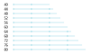
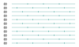

# Sampling Functions

Sampling functions are functions which take a float value 'total_length' as parameter and return an
array of float values between 0 and 1. They are used to subdivide the range [0, 1] into segments,
based on the parameters of the sampling function.

The regular sampling for example distributes the samples evenly over the full range:

```python
from stitch_generator.sampling.sample_by_length import regular

regular_sampling = regular(segment_length=2)
samples = regular_sampling(total_length=10)
print(samples)
```

Output:

    array([0. , 0.2, 0.4, 0.6, 0.8, 1. ])

The resulting samples can be used as parameter for a Function2D of the length total_length to get
evenly spaced points as stitch coordinates:

```python
from stitch_generator.shapes.line import line
function_2d = line(origin=(0,0), to = (10, 0))
stitches = function_2d(samples)
print (stitches)
````

Output:
```python
array([[ 0.,  0.],
       [ 2.,  0.],
       [ 4.,  0.],
       [ 6.,  0.],
       [ 8.,  0.],
       [10.,  0.]])
```

## Sampling by length
The `sampling_by_length` or `regular` sampling ensures that a sample is at the start (value 0) and
a sample is at the end (value 1) and there are full segments of equal length between them.

Example:

    sampling_by_length(segment_length=20)

This sampling will divide a total length of 60 in three equal segments of length 20. Lengths above
60 have an increased segment size. At length 70 the number of segments is increased to 4 and the
segments are smaller than 20. With increasing total length the segment length is increased to 20
again:


## Sampling by fixed length
The `sampling_by_fixed_length` keep the segment length fixed and fits as many segments as possible
into the total length.

Example: 

    sampling_by_fixed_length(segment_length=20)



The `sampling_by_fixed_length` has a parameter `alignment` that defines how the segments are aligned
in the total length. The default is 0 and ensures that there is always a sample at value 0.

An alignment of 0.5 ensures a sample in the middle of the total length:

    sampling_by_fixed_length(segment_length=20, alignment=0.5)


An alignment of 1 ensures a sample at the end of the total length:

    sampling_by_fixed_length(segment_length=20, alignment=1)


## Tatami sampling

The above sampling functions return the same samples when they are called repeatedly with the same
total length. In contrast, the `tatami sampling` returns samples which are shifted with an offset in
each subsequent call.

Example: A tatami sampling where the segments are shifted by 1/3 in each call:

    tatami_sampling(segment_length=20, offsets=[0, 1 / 3, 2 / 3], alignment=0)



The same tatami sampling when called with different length values:


## Sampling by density


 