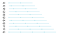
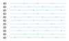

# Subdivision Functions

Subdivision functions are functions which subdivide a length into segments. The input is a length value and the output
is an array of values between 0 and 1, which represent relative offsets of the segment boundaries along the length.

There are various different ways to subdivide a length, for example into regular equally long segments or into segments
of a fixed length.

For example, the subdivision_by_length distributes the values evenly over the full length:

```python
from stitch_generator.subdivision.subdivide_by_length import subdivision_by_length

# create a subdivision function that subdivides into segments of length 2
subdivision = subdivision_by_length(segment_length=2)

# subdivide the length 10 with the subdivision function
offsets = subdivision(total_length=10)

print(offsets)
```

Output:

    array([0. , 0.2, 0.4, 0.6, 0.8, 1. ])

The range is subdivided into five segments. The first segment goes from `0`to `0.2` of the total length, i.e. from 0 to
2.

## Subdivision by length

The `subdivision_by_length` or `regular` subdivision ensures that a value is at the start (value 0)
and a value is at the end (value 1) and that the segments between them have equal lengths.

Example:

    subdivision_by_length(segment_length=20)

This subdivision will divide a total length of 60 in three equal segments of length 20. Lengths above 60 have an
increased segment size. At length 70 the number of segments is increased to 4 and the segments are smaller than 20. With
increasing total length the segment length is increased to 20 again:


Subdivision by length does not guarantee the exact segment length, but it guarantees that all values are equally spaced.

## Subdivision by fixed length

The `subdivision_by_fixed_length` keeps the segment length fixed and fits as many segments as possible into the total
length.

Example:

    subdivision_by_fixed_length(segment_length=20)


Subdivision by fixed length guarantees that the segment length is the requested segment length for all segments which
fully fit into the length. The first and last segment may be shorter, based on the alignment.

### Alignment

The `subdivision_by_fixed_length` has a parameter `alignment` that defines how the segments are aligned in the total
length. The alignment is relative to the total length of the subdivision, i.e. an alignment of 0 ensures that a full
segment stars at 0. An alignment of 1 ensures that a full segment ends at value 1. An alignment of 0.5 ensures that a
segment starts at 0.5, i.e. at the middle of the total length.

Example `alignment=0`:

    subdivision_by_fixed_length(segment_length=20, alignment=0)


Example `alignment=0.5`:

    subdivision_by_fixed_length(segment_length=20, alignment=0.5)


Example `alignment=1`:

    subdivision_by_fixed_length(segment_length=20, alignment=1)



### Offset

The `subdivision_by_fixed_length` has a parameter `offset` that shifts the segments by an offset relative to the segment
length. An offset of 0 does not shift the segments. An offset of 0.5 shifts the segments by half a segment length. An
offset of 1 shifts the segments by one full segment length, which has the same result as offset 0.

Example `offset=0.5`:

    subdivision_by_fixed_length(segment_length=20, offset=0.5)


## Subdivision by Number

The `subdivision_by_number` always returns the same number of segments, independent of the total length.

Example:

    subdivision_by_number(number_of_segments=4)


## Subdivision by pattern

The `subdivision_by_pattern` creates segments with a repeating pattern. The pattern is an array of values in the range
between 0 and 1. The pattern_length defines how long one repetition of the pattern is.

The parameter alignment is defined the same way as in `subdivision_by_fixed_length`. The alignment defines where along
the total length one pattern repetition begins. The parameter offset defines how far the pattern is shifted relative to
one pattern length.

Example:

    subdivision_by_pattern(pattern=[0, 0.25], pattern_length=10, alignment=0, offset=0)


Example:

    subdivision_by_pattern(pattern=[0.4, 0.5, 0.6], pattern_length=15, alignment=0.5, offset=0.5)


## Subdivision by number

The `subdivision_by_number` always returns the same number of segments, independent of the total length.

Example:

    subdivision_by_number(number_of_segments=4)


## Tatami subdivision

tatami is a subdivision by fixed length with a subdivision modifier, that loops through different offset values each
time the subdivision function is called. This means, that the subdivision function returns values which are shifted with
an offset in each subsequent call.

The parameter `alignment` is defined in the same way as in `subdivision_by_fixed_length`
. `minimal_segment_size` defines how near a value can be to the start or end. Values which are closer to the start and
end are skipped. This avoids very short segments which are not suitable for embroidery.

Example: A tatami subdivision where the segments are shifted by 1/3 in each call:

    tatami_3_1(segment_length=20)



Example: A tatami subdivision with two different offsets and where each offset is repeated two times before switching to
the next offset.

    tatami(segment_length=15, steps=2, repetitions=2, alignment=0, minimal_segment_size=1)


Example: A tatami subdivision with two different offsets and where each offset is repeated four times before switching
to the next offset.

    tatami(segment_length=20, steps=2, repetitions=4, alignment=0, minimal_segment_size=1)


## Subdivision by density

Subdivision by density distributes the values with a varying density. The density along the total length is defined by a
1D Function.

Example: Subdivision with a density function that interpolates between 1 and 0. This leads to a high density at the
start (short segments, values are close to each other) and a low density at the end
(longer segments, values are further apart). `segment_length` is the minimal length of the segments.

    subdivision_by_density(segment_length=2, density_distribution=linear_1_0)


